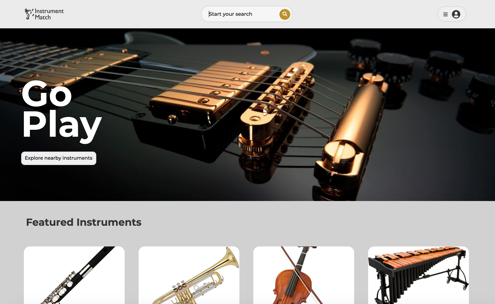
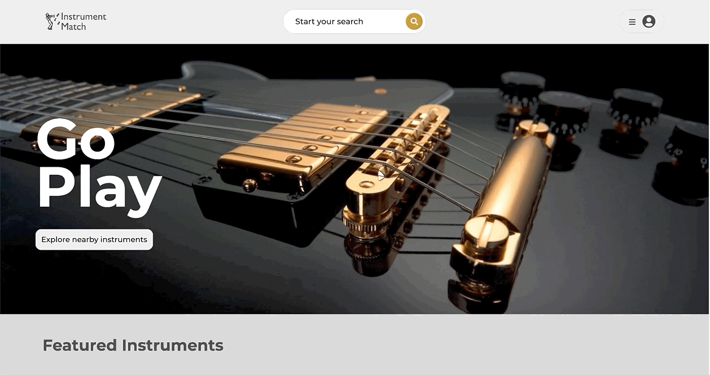
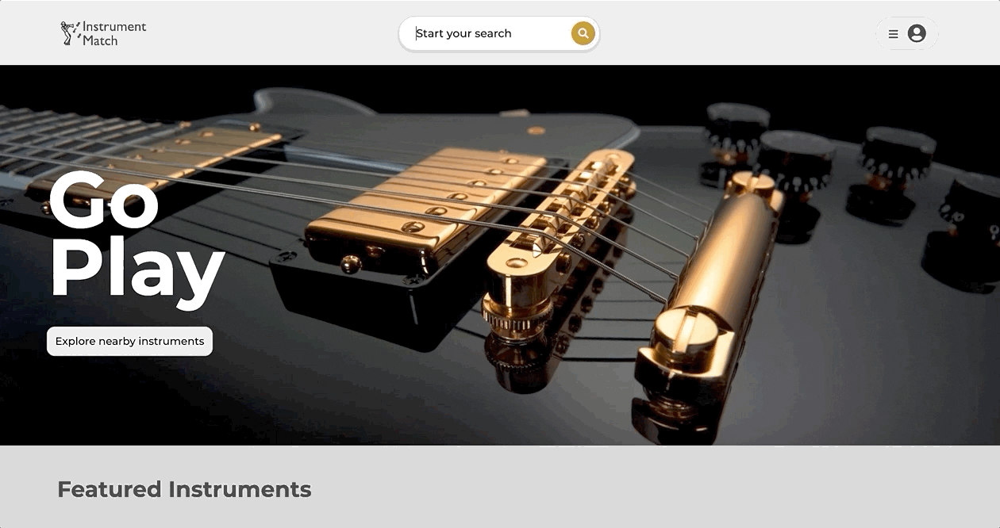
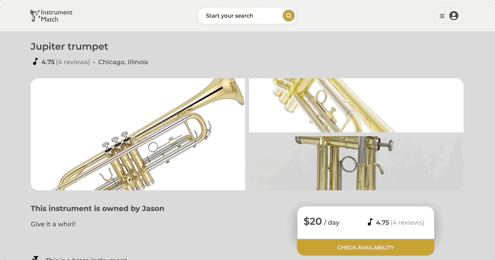
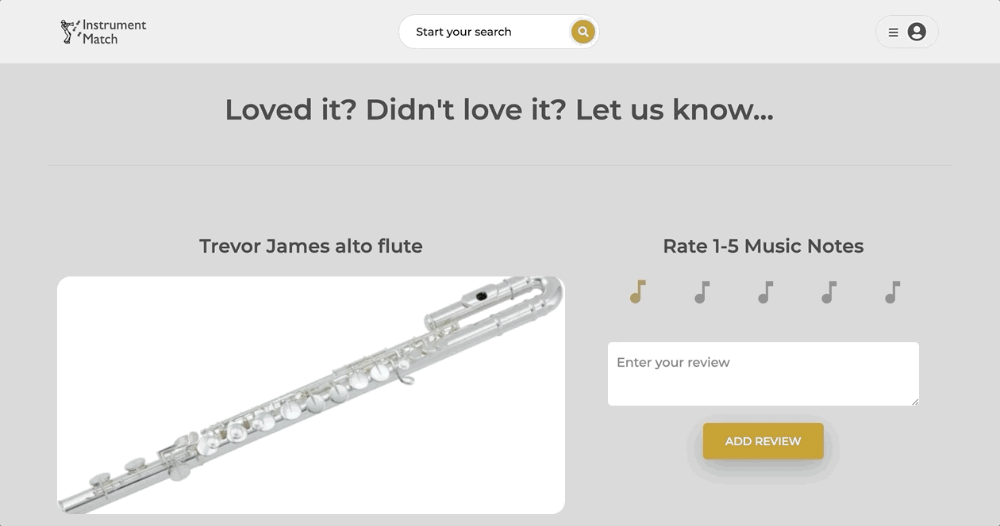

<!-- PROJECT SHIELDS -->
<!--
*** I'm using markdown "reference style" links for readability.
*** Reference links are enclosed in brackets [ ] instead of parentheses ( ).
*** See the bottom of this document for the declaration of the reference variables
*** for contributors-url, forks-url, etc. This is an optional, concise syntax you may use.
*** https://www.markdownguide.org/basic-syntax/#reference-style-links
-->


<!-- PROJECT LOGO -->
<br />
<p align="center">
  <a href="https://github.com/tedjanton/instrumentmatch">
    
  </a>

  <h3 align="center">Instrument Match</h3>

  <p align="center">
    Instrument Match is a unique take on an AirBnB clone for the gigging musician on the go. This application includes a rental and booking database for any musical instrument you might want to...or need to rent! You can browse instruments via search by instrument family, name, and location (with a Google Maps API integration). Users can make sure they are getting a great, reliable instrument before they book by reading reviews, viewing when it was last serviced, and seeing each instrument's average "Musical Note" 5-star rating. Once you book a rental, you can also add your own review and rating. If you decide to change you mind, you can cancel your rental as long as it is before the rental start date.
    <br />
    <a href="https://github.com/tedjanton/instrumentmatch"><strong>Explore the docs »</strong></a>
    <br />
    <br />
    <a href="https://instrumentmatch.herokuapp.com/">View Site</a>
    ·
    <a href="https://github.com/tedjanton/instrumentmatch/issues">Report Bug</a>
    ·
    <a href="https://github.com/tedjanton/instrumentmatch/issues">Request Feature</a>
  </p>
</p>


<!-- TABLE OF CONTENTS -->
<details open="open">
  <summary><h2 style="display: inline-block">Table of Contents</h2></summary>
  <ol>
    <li>
      <a href="#about-the-project">About The Project</a>
      <ul>
        <li><a href="#built-with">Built With</a></li>
      </ul>
    </li>
    <li>
      <a href="#getting-started">Getting Started</a>
      <ul>
        <li><a href="#prerequisites">Prerequisites</a></li>
        <li><a href="#installation">Installation</a></li>
      </ul>
    </li>
    <li><a href="#usage">Usage</a></li>
    <li><a href="#roadmap">Roadmap</a></li>
    <li><a href="#contributing">Contributing</a></li>
    <li><a href="#license">License</a></li>
    <li><a href="#contact">Contact</a></li>
    <li><a href="#acknowledgements">Acknowledgements</a></li>
  </ol>
</details>


<!-- ABOUT THE PROJECT -->
## About The Project

[Click here to view Instrument Match live on the web!](https://instrumentmatch.herokuapp.com/)
<br>
</br>


### Built With

* [JavaScript]()
  * [React]()
  * [Redux]()
  * [Express]()
  * [Node.js]()
* [HTML]()
* [CSS]()


<!-- GETTING STARTED -->
## Getting Started

To get a local copy up and running follow these simple steps.

### Prerequisites

Here is everything we need you to do to get started with Instrument Match.
* npm
  ```sh
  npm install npm@latest -g
  ```

### Installation

1. Clone the repo
   ```sh
   git clone https://github.com/tedjanton/instrumentmatch
   ```
2. Install NPM packages
   ```sh
   npm install
   ```
3. Add a '.env' with your environment variables to the root of your local directory

4. Create a postgreSQL user
    ```sh
    CREATE USERS <<your username>> WITH PASSWORD <<your password>> CREATEDB
    ```
5. Create your database
    ```sh
    npx dotenv sequelize db:create
    ```
6. Migrate and seed your database
    ```sh
    npx dotenv sequelize db:migrate
    npx dotenv sequelize db:seed:all
    ```

<!-- USAGE EXAMPLES -->
## Usage
### An easy-to-use login with a pre-configured Demo User.

### Search for instruments by family, name, or location.

### Edit your rentals.

### Leave a rating and a comment.



## Obstacles

### Rating API

tbd

### Reaching for images with Sequelize

tbd


<!-- ROADMAP -->
## Roadmap

See the [open issues](https://github.com/tedjanton/instrumentmatch/issues) for a list of proposed features (and known issues).


<!-- CONTRIBUTING -->
## Contributing

Contributions are what make the open source community such an amazing place to be learn, inspire, and create. Any contributions you make are **greatly appreciated**.

1. Fork the Project
2. Create your Feature Branch (`git checkout -b feature/AmazingFeature`)
3. Commit your Changes (`git commit -m 'Add some AmazingFeature'`)
4. Push to the Branch (`git push origin feature/AmazingFeature`)
5. Open a Pull Request


<!-- CONTACT -->
## Contact & Acknowledgements


* Ted Anton - [LinkedIn](https://www.linkedin.com/in/ted-anton/) - [GitHub](https://github.com/tedjanton)


Project Link: [https://github.com/tedjanton/instrumentmatch/](https://github.com/tedjanton/instrumentmatch/)


<!-- ACKNOWLEDGEMENTS -->
